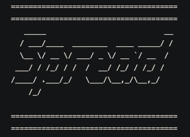

<!--
*** Thanks for checking out the Best-README-Template. If you have a suggestion
*** that would make this better, please fork the upComingEventResults_demo and create a pull request
*** or simply open an issue with the tag "enhancement".
*** Thanks again! Now go create something AMAZING! :D
***
***
***
*** To avoid retyping too much info. Do a search and replace for the following:
*** github_username, upComingEventResults_demo_name, twitter_handle, email, project_title, project_description
-->


<!-- PROJECT SHIELDS -->
<!--
*** I'm using markdown "reference style" links for readability.
*** Reference links are enclosed in brackets [ ] instead of parentheses ( ).
*** See the bottom of this document for the declaration of the reference variables
*** for contributors-url, forks-url, etc. This is an optional, concise syntax you may use.
*** https://www.markdownguide.org/basic-syntax/#reference-style-links
-->


<!-- PROJECT LOGO -->
<br />
<p align="center">
  <a href="https://github.com/MooseandSquvirrel/rubyBot_spreadSheets_demo.git">
    
  </a>

  <h3 align="center">Spread: The Weekly Data Bot</h3>

  <p align="center">
    A Selenium command-line program to automate data tracking/presentation for weekly events.
    <br />
    <a href="https://github.com/MooseandSquvirrel/rubyBot_spreadSheets_demo.git"><strong>Explore the docs »</strong></a>
  </p>
</p>


<!-- TABLE OF CONTENTS -->
<details open="open">
  <summary><h2 style="display: inline-block">Table of Contents</h2></summary>
  <ol>
    <li>
      <a href="#about-the-project">About The Project</a>
      <ul>
        <li><a href="#built-with">Built With</a></li>
      </ul>
    </li>
    <li>
      <a href="#getting-started">Getting Started</a>
      <ul>
        <li><a href="#prerequisites">Prerequisites</a></li>
        <li><a href="#installation">Installation</a></li>
      </ul>
    </li>
    <li><a href="#usage">Usage</a></li>
    <li><a href="#contact">Contact</a></li>
  </ol>
</details>


<!-- ABOUT THE PROJECT -->
## About The Project

<p align="center">
  <a href="https://github.com/MooseandSquvirrel/rubyBot_spreadSheets_demo.git">
    
  </a>
</p>

This command-line program was created with Selenium Webdriver inorder to automate
a weekly data task. It is a modified, smaller version of the original Ruby bot I created for a similar backend task, <a href="https://github.com/MooseandSquvirrel/backendSeleniumBot_demo.git">Fixit</a>. In this case, the company needed to know the weekly usage stats for their partnership companies within their app. This could take a team member anywhere from two hours to a full day to complete. The solution was to automate the process.

Using Selenium's Ruby version, I created a command-line tool that asked for: 
* Employee info for the backend tool authentication login.
* Each events' info that eventually needed to be written for formatting in a master spreadsheet.
* A phone number, not required, for twilio API text confirmation that the program finished if desired.

The program would then run numerous checks on the events in question, if the dates of the events' stats were within a particular time frame to be counted and more. It then did the entire manual process with Selenium WebDriver running headless in a terminal. In this modified version of the original bot, a new function was incorporated from the backend tool and accounted for in the code (B10). It was created by the dev team to collect usage stats more easily by the backend tool. This is the function that allowed this bot to be smaller, faster, version of the original, and used for weekly instead of daily data pulls. The process was able to be set up as a cron job with a shell script running locally.

The final output was a parsed, formated, RubyXL spreadsheet with organization and color coding.

This bot ended up saving countless hours of work by not requiring employees to sit and wait for data to return from servers and to then have to manually organize and rewrite/format the data for presentation.

NOTE: This bot was not meant as an open-source project, and therefore having removed files and lines of code essential to it's functioning for demo purposes, in it's current state it is not functional. However, you are welcome to download and analyze the project and modify the code for use in your own Ruby-based Selenium bots!

### Built With

* [Ruby](https://www.ruby-lang.org/en/)
* [Selenium](https://www.selenium.dev/) / [Selenium WebDriver](https://www.selenium.dev/documentation/en/webdriver/)


<!-- GETTING STARTED -->
## Getting Started

This program was not originally meant for being open-sourced and therefore
is not fully functional in it's current state. However, it can be used as a starting point for Ruby-based Selenium web automation with command-line arguement input. So feel free to download the project and cut it up to meet your personal needs, or simply for reviewing how Selenium can be used. 

* **For a walk-through on how to begin Selenium automation, visit my tutorial <a href="https://medium.com/@andygardnerucla/automate-your-work-with-selenium-2578d5bf61a8">here</a>.**


### Prerequisites

If this were a functioning open-source version of the program, packages required would be:
   ```sh
  gem install rubyXL rubyXL/convenience_methods selenium-webdriver rubygems awesome_print date capybara pp ap rspec/expectations io/console twilio-ruby
   ```

### Installation

1. Git clone.
   ```sh
   git clone https://github.com/MooseandSquvirrel/rubyBot_spreadSheets_demo.git
   ```
2. (If non-demo version, begin program).
   ```sh
   ruby spread.rb
   ```   

<!-- USAGE EXAMPLES -->
## Usage

Creating Ruby Selenium Bots with command-line interfaces to automate data analysis.

_To view the code: [Documentation](https://github.com/MooseandSquvirrel/rubyBot_spreadSheets_demo.git)_


<!-- CONTACT -->
## Contact

Andy Gardner - web.dev.bud1@gmail.com

Project Link: [https://github.com/MooseandSquvirrel/rubyBot_spreadSheets_demo.git](https://github.com/MooseandSquvirrel/rubyBot_spreadSheets_demo.git)

### Attributes

<div>Icons made by <a href="https://www.flaticon.com/authors/freepik" title="Freepik">Freepik</a> from <a href="https://www.flaticon.com/" title="Flaticon">www.flaticon.com</a></div>
